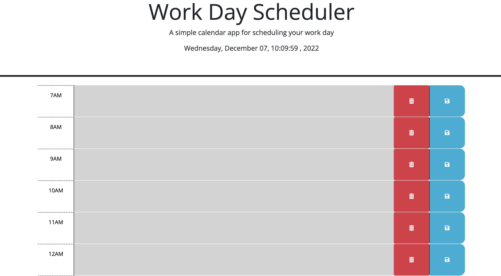
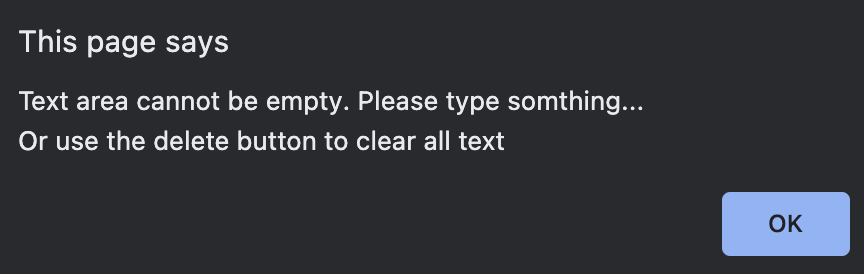
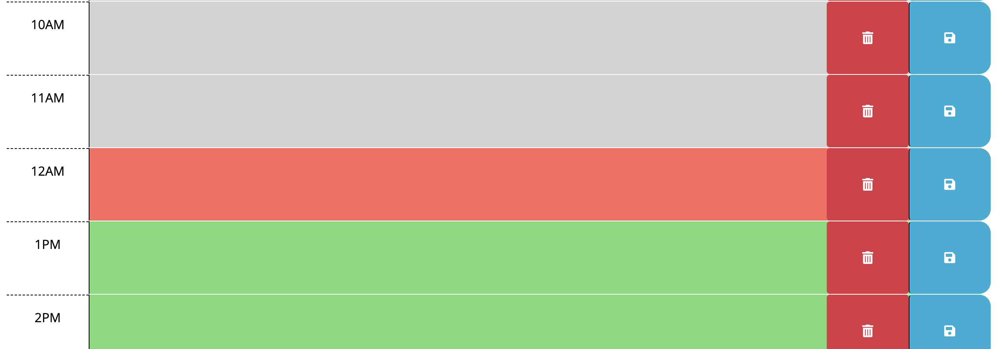

# Andrew's Work Day Scheduler

## 🐳 Overview:
> * Scheduler application using HTML, CSS(BootStrap), JavaScript(JQuery)
>
> * Delete Button & Save Button with local storage
>
> * dayjs api to get the real-life time

> **Note**: Need other library to format the diplay-time
>


## 🐯 Website URL:
❗❗❗ ☛ [Clik Me To The Page!](https://andrew-techmaster.github.io/Andrew-UWBootcamp-Challenge-05-Calendar-Scheduler/) ☚ ❗❗❗
```
https://andrew-techmaster.github.io/Andrew-UWBootcamp-Challenge-05-Calendar-Scheduler/
```

## 🦊 Screenshots Of The Applications:

||
|:--:| 
| *Click start to begin the quiz* |

||
|:--:| 
| *Demo for one of the question* |

||
|:--:| 
| *Click "View High Score" button to diplay the rusult* |

### The following shows some of the application:
||
|:--:| 
| *When user select incorrect answer* |

||
|:--:| 
| *When user select right answer* |

||
|:--:| 
|*When users finish the quiz before time is up*|
- - -
© 2022 edX Boot Camps LLC. Confidential and Proprietary. All Rights Reserved.
